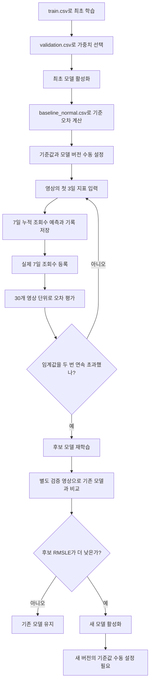

# ViewPilot 구현 상세 설명

기준일: 2026-10-01. `/api/v1` 경로로 정리된 현재 코드를 기준으로 작성했습니다.

이 문서는 영상 데이터가 입력된 뒤 예측 결과가 만들어지고, 실제 결과를 확인한 후 모델을 바꾸기까지의 과정을 설명합니다. 파일 이름만 나열하지 않고 각 코드가 필요한 이유와 실행 순서를 함께 정리했습니다. 명령어는 프로젝트 루트에서 실행하는 것을 기준으로 합니다.

빠른 실행은 [README](../README.md), 실제 실험 수치는 [시나리오 결과](scenario_results.json)를 참고하세요.

## 1. 전체 구현을 먼저 이해하기

현재 구현은 두 흐름으로 나누어 보면 이해하기 쉽습니다.

첫 번째는 **영상 하나의 성과를 예측하는 흐름**입니다. 게시 후 첫 3일의 조회수·노출 수·평균 시청 비율과 채널 구독자 수·영상 카테고리를 입력하면, 게시 후 7일까지의 누적 조회수를 반환합니다.

두 번째는 **이 예측 모델이 계속 쓸 만한지 확인하는 흐름**입니다. 실제 7일 조회수가 확보되면 당시 예측과 비교합니다. 오차가 여러 영상에서 반복적으로 커지면 드리프트 의심 신호를 내고, 데이터를 준비해 추가 학습합니다. 기존 모델과 후보 모델을 같은 검증 영상에서 비교해 더 나아진 경우에만 교체합니다.



그림의 재학습은 자동 재학습이 켜져 있고 학습·검증 데이터가 준비된 경우입니다. 데이터가 없거나 검사를 통과하지 못하면 사유를 남기고 보류합니다.

여기서 ‘배포’는 **현재 예측에 사용하는 모델 버전을 바꾸는 것**입니다. 새 클라우드 서버를 만들거나 컨테이너를 다시 배포하는 기능을 뜻하지 않습니다.

## 2. 주요 파일은 어떤 역할을 하나?

요청을 받는 부분, 데이터를 다루는 부분, 모델을 학습·로드하는 부분을 나누었습니다.

- `serving_app/main.py`: FastAPI 실행, 라우터 연결, 오류 응답, API 처리 시간 기록을 담당합니다.
- `serving_app/schemas.py`: JSON과 CSV에 어떤 값이 들어와야 하는지 정의합니다.
- `serving_app/routers/predict.py`: 영상 예측, 실제값 등록, 시뮬레이션 요청을 받습니다.
- `serving_app/routers/data.py`: CSV를 읽고 용도별로 저장합니다.
- `serving_app/routers/training.py`: 학습 API 요청을 학습 함수에 연결합니다.
- `data/features.py`: CSV 검증, 학습·검증 분리 검사, 숫자 변환, 모델 입력 생성을 담당합니다.
- `data/observations.py`: 최초 예측, 나중에 도착한 실제값, 드리프트 평가 묶음을 SQLite에 저장합니다.
- `data/baselines.py`: 기준 RMSLE와 기준 영상 ID를 모델 버전별로 보관합니다.
- `serving_app/lstm_model.py`: LSTM 층 구조를 정의합니다.
- `serving_app/train_and_register.py`: 최초 학습, 추가 학습, 검증, 모델 선택과 등록을 수행합니다.
- `serving_app/model_loader.py`: 저장된 모델과 전처리를 함께 읽고 현재 모델을 메모리에 보관합니다.
- `serving_app/monitoring/drift_detector.py`: RMSLE와 드리프트 조건을 계산합니다.
- `serving_app/monitoring/retrain_trigger.py`: 평가 결과를 보고 재학습을 실행하거나 보류합니다.
- `scripts/run_scenarios.py`: 정상 데이터 평가부터 드리프트 감지·재학습·교체 판단까지 API로 실행합니다.

예를 들어 예측 API는 직접 LSTM을 만들거나 CSV의 숫자를 표준화하지 않습니다. 입력 검증과 예측을 담당하는 공통 함수를 호출합니다. 이렇게 해서 최초 학습·API 예측·기준값 계산이 같은 데이터 변환 규칙을 사용하도록 했습니다.

## 3. 데이터 한 행은 영상 하나다

CSV의 한 행은 특정 영상 하나를 나타냅니다. 여러 영상의 조회수를 날짜순으로 이어 붙여 하나의 시계열로 만들지 않습니다.

```csv
video_id,published_at,day1_views,day1_impressions,day1_avg_view_percentage,day2_views,day2_impressions,day2_avg_view_percentage,day3_views,day3_impressions,day3_avg_view_percentage,subscriber_count_at_publish,category,target_views_day7
vid_example,2026-09-01T00:00:00Z,3000,40000,45.5,2400,32000,43.2,1800,25000,41.8,15000,gaming,12000
```

이 영상은 1일차에 3,000회, 2일차에 2,400회, 3일차에 1,800회 조회됐습니다. 첫 3일 합계는 7,200회이고, 학습 정답인 7일 누적 조회수는 12,000회입니다.

시간 구간은 게시 시각을 기준으로 고정합니다.

- `day1_*`: 게시 후 0~24시간의 지표
- `day2_*`: 게시 후 24~48시간의 지표
- `day3_*`: 게시 후 48~72시간의 지표
- `target_views_day7`: 게시 후 0~168시간의 누적 조회수

`day2_views`는 2일 누적 조회수가 아니라 **두 번째 24시간 구간에서 발생한 조회수**입니다. 모델의 목표는 4~7일 동안 추가로 발생할 조회수만이 아니라, **첫 3일을 포함한 7일 누적 조회수**입니다.

평균 시청 비율은 영상 길이에 비해 평균적으로 어느 정도를 시청했는지 나타내는 지표이며 `45.5`처럼 퍼센트 값으로 받습니다. 코드에서는 100을 초과한 값을 일괄 거절하지 않습니다. 이 값을 영상의 재미에 대한 직접적인 점수로 해석하지는 않습니다.

14개 CSV 컬럼의 역할은 다음과 같습니다.

- 식별·시간 관리 2개: `video_id`, `published_at`
- 모델에 전달할 원본 입력 11개: 일별 지표 9개, 구독자 수 1개, 카테고리 1개
- 학습·평가 정답 1개: `target_views_day7`

`video_id`와 `published_at`은 저장·중복 검사·시간 검사에 사용하며 현재 모델 피처에 포함하지 않습니다. 정답도 입력에서 제외합니다. JSON 예측 요청은 정답을 빼고 보내야 하며, CSV 예측은 정답 컬럼이 있어도 이를 무시합니다.

## 4. CSV를 받으면 먼저 무엇을 검사하나?

`schemas.py`의 Pydantic 모델과 `features.py`의 CSV 파서가 입력을 확인합니다.

조회수·노출 수·구독자 수는 0 이상이어야 하고, 시청 비율은 0 이상의 유한한 수여야 합니다. `NaN`, 무한대, 비어 있는 카테고리, 시간대 정보가 없는 게시 시각 등은 허용하지 않습니다. 카테고리는 소문자로 통일하고 게시 시각은 UTC로 정규화합니다.

CSV에서는 필수 컬럼 누락, 중복 헤더, 정의되지 않은 컬럼, 파일 안의 중복 영상 ID, 빈 파일을 검사합니다. 7일 누적 조회수가 첫 3일 조회수 합보다 작은 행도 거절합니다.

업로드는 UTF-8 CSV를 사용하며 최대 10MB입니다. 업로드 성공은 **형식 검사를 통과하고 파일이 저장됐다는 뜻**입니다. 학습 시점에는 최소 샘플 수와 학습·검증 중복, 시간 간격까지 추가로 검사합니다.

학습 데이터는 `train`, 검증 데이터는 `validation`, 일반 재학습 데이터는 `retrain_train`, 재학습 검증 데이터는 `retrain_validation`으로 나누어 저장합니다. 서로 다른 용도의 파일이 최근 파일이라는 이유만으로 다른 작업에 사용되지 않도록 했습니다.

현재 YouTube API에서 자동 수집하는 기능은 없습니다. 팀이 준비한 CSV나 클라이언트의 JSON 요청으로 데이터를 받습니다.

## 5. 14개 컬럼이 어떻게 `(3, 8)` 입력이 되나?

LSTM에는 영상 한 개를 **3일 × 하루 8개 숫자**로 전달합니다. 제공 데이터의 카테고리가 4종류이기 때문입니다.

하루 입력은 다음과 같습니다.

```text
해당 날짜 조회수
해당 날짜 노출 수
해당 날짜 평균 시청 비율
게시 당시 구독자 수
카테고리 표시 숫자 4개
```

따라서 각 날짜에는 수치 4개와 카테고리 4개, 총 8개가 들어갑니다. 구독자 수와 카테고리는 1·2·3일차 모두 같은 값을 반복합니다.

```text
영상 A
  1일차: [조회수1, 노출수1, 시청비율1, 구독자수, 카테고리 4개]
  2일차: [조회수2, 노출수2, 시청비율2, 구독자수, 카테고리 4개]
  3일차: [조회수3, 노출수3, 시청비율3, 구독자수, 카테고리 4개]

영상 N개를 한꺼번에 표현하면 (N, 3, 8)
```

CSV의 컬럼 수와 LSTM의 시점별 입력 크기는 다른 개념입니다. 현재 입력 크기는 15로 고정된 값이 아닙니다. 실제 코드의 시점별 입력 너비는 `4 + 학습 데이터의 카테고리 개수`입니다.

### 숫자 변환 순서

조회수·노출 수·구독자 수에는 `log1p(x)`, 즉 `log(1+x)`를 적용합니다. 값이 큰 영상과 작은 영상의 숫자 차이를 줄이면서 0도 처리하기 위한 변환입니다. 평균 시청 비율은 100으로 나눕니다.

그다음 학습 데이터에서 구한 평균과 표준편차로 수치 4개를 표준화합니다.

```text
표준화 값 = (변환된 값 - 학습 평균) / 학습 표준편차
```

평균과 표준편차는 최초 `train.csv`의 모든 영상·세 날짜를 사용해 피처별로 구합니다. 검증 데이터나 신규 영상으로 다시 계산하지 않습니다. 이 설정은 `preprocessor.json`에 저장합니다.

카테고리는 원핫 인코딩으로 바꿉니다. 제공 데이터의 순서는 gaming, education, entertainment, lifestyle입니다.

```text
 gaming        → [1, 0, 0, 0]
 education     → [0, 1, 0, 0]
 entertainment → [0, 0, 1, 0]
 lifestyle     → [0, 0, 0, 1]
```

최초 학습에 없던 카테고리는 예측 시 모두 0으로 처리합니다. 입력을 받을 수는 있지만 새로운 카테고리의 특성을 학습했다는 뜻은 아닙니다.

## 6. LSTM은 무엇을 예측하도록 학습하나?

LSTM은 앞선 시점의 정보를 다음 시점에 전달하면서 순서가 있는 입력을 처리하는 모델입니다. 여기서는 한 영상의 1일차, 2일차, 3일차 지표를 순서대로 읽습니다.

현재 층 구성은 다음과 같습니다.

```text
입력 (3, 8)
→ LSTM 32
→ LSTM 32
→ LSTM 16
→ Dense 16, ReLU
→ Dense 1
```

앞의 두 LSTM은 날짜별 출력을 다음 층으로 전달하고, 마지막 LSTM은 세 날짜를 처리한 결과를 하나의 벡터로 전달합니다. 마지막 Dense 층이 숫자 하나를 출력합니다.

이 숫자는 조회수 자체가 아니라 **`log1p(7일 누적 조회수)`의 예측값**입니다. 학습 손실은 이 로그 값과 정답 로그 값의 MSE입니다. 최초 학습은 Adam, 학습률 `1e-3`, 배치 크기 32를 사용합니다.

LSTM 구조는 기존 실습 코드를 유지한 선택입니다. 다른 모델과 비교해서 ViewPilot에 가장 우수한 모델임을 입증한 상태는 아닙니다.

### 예측값을 다시 조회수로 바꾸기

모델 출력에 `expm1`, 즉 `exp(x)-1`을 적용해 조회수 단위로 복원합니다. 이후 정수로 반올림하고 첫 3일 조회수 합보다 작으면 그 합으로 보정합니다.

예를 들어 첫 3일에 이미 7,200회가 발생했는데 모델이 6,800회를 예측했다면 응답은 7,200회입니다. 누적 조회수라는 정답 정의에 맞춘 하한 처리입니다. 이 처리는 API뿐 아니라 학습 평가·베이스라인·드리프트 계산에도 동일하게 적용됩니다.

## 7. 최초 모델은 어떻게 선택하나?

최초 학습에는 두 파일을 별도로 전달합니다.

```bash
python -m serving_app.train_and_register \
  --train data/synthetic/train.csv \
  --validation data/synthetic/validation.csv \
  --epochs 100 --patience 10
```

`train.csv` 3,000개는 전처리 기준을 구하고 모델 가중치를 학습하는 데 사용합니다. `validation.csv` 600개는 가중치를 직접 갱신하지 않고, 각 epoch의 검증 손실을 계산하는 데 사용합니다.

한 epoch는 학습 데이터를 한 차례 사용하는 단위입니다. 최대 100 epoch 동안 학습하되 검증 손실인 `val_loss`가 10 epoch 동안 개선되지 않으면 조기 종료합니다. 일찍 멈추지 않고 최대 횟수까지 진행해도 검증 손실이 가장 낮았던 가중치를 복원합니다.

이후 조회수 단위로 복원한 예측으로 RMSLE와 MAE를 계산하고 모델·전처리·학습 기록을 저장합니다.

최초 학습은 기준 RMSLE인 B가 없어도 가능합니다. `DEPLOY_RMSLE_GATE`가 비어 있으면 검증으로 선택한 모델을 활성화합니다. 따라서 최초 활성화 자체가 별도 품질 상한 통과를 의미하지는 않습니다. 선택 상한을 지정한 경우에만 그 값도 검사합니다.

이미 활성 모델이 있다면 최초 학습으로 덮어쓰지 않습니다. 이후 변경은 재학습 경로로 진행합니다.

## 8. 학습과 검증을 나누는 이유

학습한 영상을 그대로 평가하면 모델이 새로운 영상에서도 잘 예측하는지 구분하기 어렵습니다. 그래서 학습·검증 영상 ID가 겹치지 않도록 검사합니다.

시간도 확인합니다. 일반 학습·재학습은 학습 영상의 정답을 알 수 있는 시점이 첫 검증 영상의 예측 시점보다 늦으면 거절합니다.

```text
마지막 학습 영상 게시 시각 + 168시간
≤ 첫 검증 영상 게시 시각 + 72시간
```

예를 들어 학습에 사용할 영상의 7일 정답이 아직 없는데, 그 정답으로 학습한 모델이 이미 지난 시점의 영상을 예측했다고 평가해서는 안 됩니다. 현재 코드는 이 문제를 방지하기 위해 일반 분할에서 게시 시점 간격을 검사합니다.

학습 최소 30개, 검증 최소 10개가 필요합니다. 이 수량은 실행 가능한 최소 조건이며, 충분한 모델 품질을 보장하는 수량은 아닙니다.

드리프트 시나리오의 60/60 분할에는 별도의 과거 데이터 비교 방식이 적용됩니다. 이 차이는 13절에서 설명합니다.

## 9. 베이스라인은 모델이 아니라 기준 오차다

이 프로젝트에서 B는 “선택된 모델이 기준 영상 30개에서 기록한 RMSLE”입니다. 비교용으로 따로 학습한 모델을 뜻하지 않습니다.

```bash
python scripts/calculate_baseline.py --csv data/synthetic/baseline_normal.csv
```

스크립트는 현재 활성 모델을 고정한 상태에서 서로 다른 기준 영상 30개를 예측하고 RMSLE를 계산합니다. 모델 학습은 하지 않습니다. 결과와 영상 ID를 `runtime/baselines/<모델버전>.json`에 저장하고 다음 설정값을 출력합니다.

```dotenv
BASELINE_RMSLE=계산된_값
BASELINE_MODEL_VERSION=해당_모델버전
```

출력된 실제 숫자를 `.env`에 복사합니다. 위 표기는 자리 표시이므로 그대로 사용하면 안 됩니다. 서버는 저장된 계산 결과와 환경변수의 값이 같은지도 확인합니다.

기준값은 모델 버전별로 고정합니다. 같은 버전의 기준값을 다른 결과로 덮어쓸 수 없습니다. 새 모델에는 이전 버전의 B를 적용하지 않습니다. 기준 영상은 이후 학습이나 드리프트 평가에서 제외합니다.

## 10. 예측과 실제 결과는 어떻게 쌓이나?

운영 예측 경로는 `POST /api/v1/videos/predictions`입니다. 게시 후 72시간이 지난 영상의 초기 지표를 받습니다.

서버는 현재 모델과 전처리를 읽고 7일 조회수를 예측한 뒤, 결과를 SQLite에 기록합니다. 응답에는 아래 값이 들어갑니다. 다음은 형식 설명용 예시이며 특정 모델의 실제 출력은 아닙니다.

```json
{
  "prediction_id": "생성된_예측_ID",
  "video_id": "vid_example",
  "predicted_views_day7": 12000,
  "model_version": "1"
}
```

`prediction_id`는 나중에 실제값을 연결할 때 쓰는 예측 기록의 식별자입니다. 영상 ID뿐 아니라 **어떤 모델로, 어떤 입력을 받아, 얼마를 예측했는지**를 함께 남깁니다.

게시 후 168시간이 지나 실제 7일 조회수가 확보되면 `POST /api/v1/videos/actuals`로 등록합니다.

```json
{
  "prediction_id": "예측_응답에서_받은_ID",
  "target_views_day7": 12000
}
```

이 요청은 해당 예측에 실제값을 붙이고, 그 모델 버전의 평가 대기 데이터를 확인합니다. 30개가 모였다면 드리프트 평가를 수행합니다.

`forecasts`에는 입력 JSON, 예측값, 실제값, 모델 버전, 시각, 모드, 평가 묶음 번호가 저장됩니다. `evaluation_blocks`에는 30개 단위 평가 결과가 저장됩니다. 기본 파일은 `runtime/observations.db`입니다.

같은 영상·모델 버전·모드를 다시 요청해도 최초 예측을 유지합니다. 입력이나 이미 저장된 실제값을 다른 값으로 바꾸려 하면 거절합니다. 반복 요청으로 평가 영상 수가 부풀려지는 것을 막기 위한 규칙입니다.

현재 일반 예측 API는 예측 기록을 반환하지만 전체 예측 이력을 페이지별로 조회하는 별도 API는 없습니다.

## 11. RMSLE와 드리프트 조건을 풀어서 이해하기

RMSLE는 실제값과 예측값에 각각 `log(1+x)`를 적용한 뒤 차이를 제곱하고, 평균을 구해 제곱근을 취한 값입니다.

```text
RMSLE = sqrt(평균((log(1+실제값) - log(1+예측값))²))
```

조회수 규모가 큰 영상의 절대 오차만으로 전체 평가가 결정되는 현상을 줄이려는 선택입니다. 다만 RMSLE를 사용한다고 채널 규모나 카테고리의 차이가 사라지는 것은 아닙니다. RMSLE 0.1을 “오차율 10%”라고 그대로 읽어서도 안 됩니다.

운영에서는 같은 모델 버전과 같은 모드의 영상 30개를 한 묶음으로 평가합니다. 묶음은 실제값이 등록된 순서로 만들고 서로 겹치지 않습니다. 평가 완료 영상에는 `block_id`를 붙입니다.

```text
기준 오차: B
드리프트 임계값: T = max(B × 1.3, B + 0.1)

30개 묶음의 RMSLE > T → 연속 초과 횟수 +1
30개 묶음의 RMSLE ≤ T → 연속 초과 횟수 0으로 초기화
연속 초과 횟수 ≥ 2 → 재학습 검토 신호
```

`max`를 사용하므로 비율 증가와 절대 증가 중 더 큰 기준을 넘어야 합니다. 예를 들어 B가 0.1이면 T는 0.2입니다. 첫 묶음이 0.25이면 주의, 다음 묶음도 0.24이면 재학습 검토 신호입니다. 중간에 0.18이 나오면 연속 횟수는 0으로 돌아갑니다.

주요 상태는 다음과 같습니다.

- `collecting`: 아직 첫 평가 묶음이 완성되지 않았습니다.
- `ok`: 평가한 묶음의 오차가 기준 이내입니다.
- `warning`: 한 번 초과했습니다.
- `retrain_review`: 두 번 이상 연속 초과했습니다.
- `baseline_required`: 해당 버전의 기준값이 없습니다. 관측은 보관하지만 평가를 진행하지 않습니다.

이미 평가한 묶음이 있으면 다음 30개가 모이기 전에도 마지막 상태가 반환될 수 있습니다. 새 판단이 발생했는지는 `new_blocks`를 함께 확인해야 합니다.

이 신호는 **예측 오차가 반복해서 증가했다는 증거**입니다. 특정 카테고리의 유행, CTR 변화, 추천 알고리즘 변경 등 원인을 자동 확정하는 기능은 없습니다. 현재는 관련 영상 ID와 평가 수치, 검토 안내를 제공합니다. 임계값과 30개·2회 규칙도 이 프로젝트의 운영 규칙이며 통계적으로 최적임을 증명한 값은 아닙니다.

## 12. 재학습은 기존 모델에서 이어서 한다

재학습은 처음부터 새 LSTM을 만드는 방식이 아니라 기존 모델의 가중치를 복사해 추가 학습하는 방식입니다. 코드에서는 `fine_tune`으로 표현합니다.

현재 서비스에서 사용하는 모델 객체에 직접 `fit()`하지 않고 복제본을 만듭니다. 후보가 검증에 실패했는데 기존 모델의 가중치까지 바뀌는 일을 막기 위해서입니다.

전처리는 기존 설정을 유지합니다. 적은 재학습 데이터로 평균·표준편차나 카테고리 사전을 다시 만들면 기존 모델이 학습한 숫자의 의미가 달라질 수 있기 때문입니다.

드리프트 자동 재학습은 학습률을 최초의 `1e-3`에서 `1e-4`로 낮추고 최대 10 epoch 실행합니다. 검증 손실을 확인하고 가장 좋았던 가중치를 복원합니다.

수동 학습 API와 CLI는 epoch를 별도로 받습니다. 현재 요청 스키마와 CLI의 기본값은 100이므로, 수동 재학습을 10회로 실행하려면 `epochs: 10` 또는 `--epochs 10`을 명시합니다.

### 관측 데이터를 다시 학습해도 되는가?

예측 시점에는 정답이 없었지만 이후 실제값이 확보된 영상은 재학습에 사용할 수 있습니다. 코드도 이를 허용합니다. 다만 저장된 입력·실제값과 동일해야 하고, 기존 모델의 학습·검증이나 기준값 계산에 썼던 영상은 다시 사용하지 않습니다.

재학습 검증 세트는 학습 데이터와 겹치지 않아야 하며, 이미 운영·시뮬레이션에 관측 기록을 남긴 영상도 제외합니다. 현재 구현에서 검증용으로 남겨둔 데이터를 분명하게 구별하기 위한 제한입니다.

### 시나리오와 일반 재학습의 데이터 준비 차이

시나리오 API는 `retraining_validation`을 받았을 때 마지막 두 초과 묶음의 관측 영상 60개를 재학습에 연결합니다.

일반 운영의 실제값 등록 요청이나 수동 학습 API에서는 `RETRAIN_TRAIN_CSV`, `RETRAIN_VALIDATION_CSV` 또는 용도별 업로드에서 데이터를 읽습니다. 운영 DB 전체를 자동으로 분할·추출하는 작업은 구현하지 않았습니다. 재학습 데이터를 찾지 못하면 `deferred`와 이유를 반환합니다.

`AUTO_RETRAIN=false`이면 경보까지만 발생하고 `manual_review`를 반환합니다. 자동 흐름은 새 평가 묶음에서 신호가 발생할 때 실행되며, 같은 요청을 재전송했다고 다시 학습하지 않습니다.

## 13. 제공된 CSV 5개로 시나리오를 실행하는 방법

각 파일의 역할은 아래와 같습니다.

- `train.csv`, 3,000개: 최초 학습
- `validation.csv`, 600개: 최초 가중치 선택과 검증
- `baseline_normal.csv`, 30개: 활성 모델의 기준 오차 계산
- `test_normal.csv`, 120개: 정상 상태 확인, 30개씩 4묶음
- `test_drift.csv`, 120개: 앞 60개로 감지·재학습, 뒤 60개로 검증

`run_scenarios.py`는 먼저 정상 데이터 120개를 네 번 나누어 요청합니다. 다음으로 드리프트 파일을 게시 시점 순서로 정렬합니다.

드리프트 1~30번째 영상은 첫 묶음으로 전송합니다. 31~60번째 영상은 두 번째 묶음으로 전송하며, 같은 요청의 `retraining_validation`에 61~120번째 영상을 따로 담습니다.

```text
videos                 = 현재 드리프트 평가에 쓸 30개
retraining_validation  = 모델 비교용으로 남겨둔 뒤 60개
```

두 번 연속 초과하면 서버는 SQLite에서 감지에 사용한 두 묶음의 60개를 꺼내 재학습합니다. 뒤 60개는 가중치 학습이나 드리프트 기록에 넣지 않고 검증 손실 계산·가중치 선택·모델 비교에 사용합니다.

따라서 실행 후 관측 DB의 영상 수는 정상 120개와 드리프트 60개를 합친 180개입니다. 검증용 60개는 모델의 학습 메타데이터에 검증 ID로 남습니다.

새 모델이 선택되면 시나리오는 종료됩니다. 같은 검증 60개를 새 모델의 운영 성능 평가에 다시 사용하지 않습니다.

### 이 시나리오의 시간 해석

제공 파일의 60번째 영상은 2025-09-17 09:00 UTC, 61번째 영상은 같은 날 12:00 UTC에 게시됐습니다. 간격은 3시간입니다.

61번째 영상의 게시 후 72시간 시점에는 60번째 영상의 168시간 정답을 아직 알 수 없습니다. 그래서 이 60/60 분할을 “실제로 그 시점에 재학습하고 다음 영상을 예측했다”는 실험으로 해석할 수 없습니다.

현재 시나리오는 **모든 정답이 확보된 과거 데이터로 재학습과 모델 비교를 수행하는 방식**입니다. `retrospective=True`로 이 차이를 코드와 결과에 남깁니다. 게시 순서·중복·현재 시점에서의 정답 가용 여부 검사는 유지하고, 일반 학습에서 적용하는 4일 간격 검사만 다르게 처리합니다.

검증 세트는 최적 가중치와 모델 선택에도 쓰였습니다. 따라서 교체 후의 독립적인 미래 성능을 입증하려면 추가 데이터가 필요합니다.

## 14. 드리프트 조건과 모델 교체 조건은 다르다

드리프트 조건은 “추가 학습을 검토할 만큼 오차가 커졌는가?”를 판단합니다. 모델 교체 조건은 “새로 학습한 후보가 지금 모델보다 나은가?”를 판단합니다.

현재 재학습 모델의 교체 기준은 하나입니다.

```text
같은 검증 영상에서 후보 모델 RMSLE < 기존 모델 RMSLE
```

후보가 더 낮으면 교체하고, 같거나 높으면 기존 모델을 유지합니다. 드리프트 임계값 T는 교체 상한으로 사용하지 않습니다. `DEPLOY_RMSLE_GATE`도 최초 모델 선택에만 사용합니다.

따라서 현재 교체 규칙은 상대적인 개선을 확인하는 규칙입니다. 아주 작은 개선도 통과할 수 있고, 별도의 절대 품질 보장을 제공하지는 않습니다.

재학습 결과의 `status=completed`는 학습·평가를 완료했다는 뜻입니다. 실제 교체 여부는 `promoted`로 확인합니다.

- `completed`, `promoted=true`: 새 모델로 교체했습니다.
- `completed`, `promoted=false`: 비교 결과 교체하지 않았습니다.
- `deferred`: 데이터나 설정 조건을 충족하지 못해 보류했습니다.
- `failed`: 학습 중 예상하지 못한 오류가 발생했습니다.
- `skipped_old_version`: 이전 모델의 늦은 실제값이므로 현재 모델의 재학습을 실행하지 않았습니다.

## 15. 모델 파일, MLflow, 버전은 어떻게 연결되나?

학습 결과는 실행별 ID인 `run_id`를 기준으로 저장합니다.

```text
runtime/
  models/
    <run_id>/
      model.keras
      preprocessor.json
      metadata.json
    production.json
  baselines/
    <model_version>.json
  observations.db
  mlflow.db
  mlruns/
  uploads/
    train/
    validation/
    retrain_train/
    retrain_validation/
  logs/
    aiops.log
```

`model.keras`는 모델 구조와 가중치, `preprocessor.json`은 입력 변환 기준, `metadata.json`은 학습·검증 영상 ID, 성능과 학습 조건을 보관합니다.

MLflow에는 학습 파라미터, RMSLE·MAE, epoch 정보, 모델과 관련 파일이 기록됩니다. 선택된 모델은 `ViewPilot_Predictor` 이름으로 등록하고 `production` 별칭을 지정합니다.

`production.json`은 현재 활성 모델의 bundle ID와 모델 버전을 가리킵니다. 교체할 때는 후보 파일을 다시 읽고 예측 가능한지 확인한 뒤, 임시 포인터 파일을 `os.replace()`로 바꿉니다.

`model_loader.py`는 포인터가 바뀌면 새 모델과 전처리를 완전히 읽은 후 메모리 캐시를 교체합니다. 모델을 매 요청마다 디스크에서 다시 읽지는 않습니다. 기본은 로컬 모델 파일이며, `MODEL_SOURCE=mlflow`이면 등록된 MLflow 모델을 읽는 경로를 사용합니다. 이 경우에도 로컬 전처리와 메타데이터 묶음이 필요합니다.

포인터 파일 교체는 원자적으로 수행하지만, MLflow 별칭 변경과 파일 변경 전체가 하나의 DB 트랜잭션인 것은 아닙니다. 현재는 단일 프로세스 실습 범위의 모델 관리 구현입니다.

## 16. 모델 교체 후 기준값은 어떻게 되나?

예를 들어 `.env`가 v1의 기준값을 가리키는데 활성 모델이 v2가 되면 `baseline_rmsle`는 `None`이 됩니다. v1의 오차 기준을 v2에 자동 적용하지 않기 위한 동작입니다.

새 모델의 예측은 가능하지만, 해당 버전의 기준값을 설정하기 전에는 드리프트 평가가 `baseline_required` 상태가 됩니다. 현재 시나리오는 이 상태에서 종료합니다. 시연 모드에서는 서버를 재시작하면 원본 모델과 그 기준값으로 되돌아갑니다.

모니터링을 이어가려면 새 모델의 현재 운영 상황을 대표하는 기준 영상 30개를 준비하고 `calculate_baseline.py --csv ...`로 계산한 뒤 새 버전과 함께 설정합니다. 재학습이나 검증에 쓴 120개를 기준 영상으로 다시 쓰지 않습니다.

현재 코드는 이전 버전의 기준 영상이라는 이유만으로 새 버전의 계산 입력에서 무조건 배제하지는 않습니다. 하지만 환경이 바뀐 경우 과거 정상 분포가 새 기준으로 적절한지는 별도로 판단해야 합니다. 이번 실험에서는 v2 기준값을 계산하지 않았습니다.

## 17. API를 기능별로 이해하기

서비스 API는 `/api/v1` 아래에 있고 `/docs`에서 요청 스키마와 설명을 확인할 수 있습니다. 이전 `/predict`, `/data/upload` 등의 경로는 제공하지 않습니다.

### 영상 예측과 실제 성과

- `POST /api/v1/videos/predictions`: 정답을 제외한 영상 한 개의 JSON으로 예측합니다.
- `POST /api/v1/videos/predictions/csv`: 여러 영상의 CSV로 예측합니다. 응답은 `predictions` 배열입니다.
- `POST /api/v1/videos/actuals`: `prediction_id`와 실제 7일 조회수를 받아 저장하고 드리프트를 확인합니다.

### 데이터 업로드와 학습

- `POST /api/v1/datasets?purpose=train`: multipart의 `file` 필드로 CSV를 업로드합니다. 용도에 따라 `validation`, `retrain_train`, `retrain_validation`을 지정합니다.
- `GET /api/v1/datasets/latest?purpose=train`: 해당 용도의 최신 파일과 행 수, 게시 시각 범위를 반환합니다. 파일이 없으면 `exists=false`입니다.
- `POST /api/v1/models/training`: 업로드한 파일 또는 재학습 경로 설정을 사용해 학습합니다.

최초 학습 요청 예시는 다음과 같습니다.

```json
{"mode": "initial", "epochs": 100, "patience": 10}
```

일반 재학습 요청 예시는 다음과 같습니다. 필요한 재학습·검증 파일이 먼저 준비돼 있어야 합니다.

```json
{"mode": "fine_tune", "epochs": 10, "patience": 10}
```

### 시뮬레이션과 운영 상태

- `POST /api/v1/simulations/drift`: 정답 포함 `videos` 배열을 평가합니다. 선택 필드인 `retraining_validation`에 별도 검증 영상을 전달할 수 있습니다.
- `POST /api/v1/simulations/drift/csv`: 정답 포함 CSV를 평가합니다. 이 경로 자체에는 검증 배열을 따로 전달하는 기능이 없으므로, 자동 60/60 흐름은 `run_scenarios.py`의 JSON 요청을 사용합니다.
- `GET /api/v1/logs`: 로그 파일 목록을 반환합니다.
- `GET /api/v1/logs/aiops.log`: 학습·드리프트 로그의 마지막 최대 50,000자를 반환합니다.
- `GET /health`: 서버 상태와 활성 모델 버전, 기준값 등을 확인합니다.

`/health`의 `model_ready`는 활성 포인터 파일의 존재 여부를 기반으로 합니다. 매번 실제 모델 추론까지 수행하는 완전한 준비 상태 검사는 아닙니다.

대표 오류는 형식·데이터 규칙 위반 400, 찾을 수 없는 예측 404, 모델·파일 준비 부족 503, FastAPI/Pydantic 요청 스키마 위반 422입니다. 재학습 보류는 드리프트 응답 안에 이유를 담을 수 있으므로 HTTP 200만 보고 교체 성공이라고 판단하지 않습니다.

## 18. 처음부터 실행하는 순서

새로 클론한 환경에서 아래 순서대로 진행합니다.

```bash
git clone https://github.com/bmh7190/SKALA-MLOps-ViewPilot.git viewpilot
cd viewpilot
python3.11 -m venv .venv
source .venv/bin/activate
pip install -r requirements-dev.txt
cp .env.example .env
```

기존 작업 폴더에 `.env`가 이미 있다면 복사 명령으로 덮어쓰지 않고 기존 설정을 사용합니다.

먼저 최초 학습을 실행합니다.

```bash
python -m serving_app.train_and_register \
  --train data/synthetic/train.csv \
  --validation data/synthetic/validation.csv \
  --epochs 100 --patience 10
python scripts/calculate_baseline.py --csv data/synthetic/baseline_normal.csv
```

기준값 계산 결과의 `BASELINE_RMSLE`와 `BASELINE_MODEL_VERSION`을 `.env`에 입력합니다. 다른 실행에서 얻은 수치를 복사하지 말고 자신의 실행 결과를 사용합니다.

환경변수를 읽고 서버를 실행합니다. 애플리케이션이 `.env`를 자동으로 읽는 구조는 아닙니다.

```bash
set -a
source .env
set +a
python -m uvicorn serving_app.main:app --host 127.0.0.1 --port 8000 --workers 1
```

다른 터미널에서 같은 프로젝트의 가상환경을 활성화하고 시나리오를 실행합니다.

```bash
source .venv/bin/activate
python scripts/run_scenarios.py --url http://localhost:8000
```

시나리오 결과는 기본적으로 `runtime/scenario_report.json`에 저장됩니다. 대시보드 없이도 `/docs`와 이 스크립트로 확인할 수 있습니다.

같은 runtime에서 동일 영상을 반복 평가하지 않습니다. 시연 모드에서는 서버를 재시작하면 초기 상태로 복원됩니다. 일반 모드에서 처음부터 다시 실험하려면 기존 기록을 삭제하기보다 새 터미널에서 다음과 같이 별도 저장 위치를 지정하고 학습부터 반복합니다.

```bash
export VIEWPILOT_RUNTIME_DIR="$PWD/runtime/replay-next"
```

학습·기준값 계산·서버는 같은 저장 위치를 사용해야 합니다. 경로를 다시 썼다면 새 폴더 이름을 선택합니다. 실행 산출물과 `.env`는 Git에 올라가지 않으므로 새 클론에는 학습된 모델이 없습니다.

### 버튼 두 개와 재시작 초기화

시연 모드는 `DEMO_MODE=true`로 켭니다. 최초 학습·기준값 계산은 일반 모드에서 한 번 준비합니다.
원본 runtime은 준비된 출발점으로 남기고, 서버가 시작할 때마다 `runtime/demo/`를 새 복사본으로 만듭니다.
시연용 모델이 v2로 교체됐더라도 서버를 재시작하면 원본이 v1인 경우 v1부터 다시 시작합니다.
이 과정은 파일 복원이며, 학습 100 epoch를 다시 실행하는 것이 아닙니다.

`serving_app/demo.py`는 원본 모델·전처리·메타데이터·기준값을 먼저 확인합니다.
모델 버전과 기준값의 run ID가 일치하는지 검사한 뒤 복사하고, MLflow DB도 별도로 복제합니다.
새 학습 결과의 저장 위치는 시연 폴더로 변경합니다. 원본 관측 DB, 이전 시연 로그·업로드·후보 모델은 복사하지 않습니다.
직접 만든 표시 파일이 있는 시연 폴더만 초기화하며, 임의의 기존 폴더나 심볼릭 링크는 삭제하지 않습니다.

복원한 기준값과 모델 버전은 시연 프로세스 환경변수에 반영합니다. 사용자의 `.env`는 수정하지 않습니다.
`model_loader.clear_cache()`로 이전 메모리 모델을 비우고, 로그 파일도 복원 이후 엽니다.
일반 모드에서는 이 초기화 과정을 실행하지 않습니다.

대시보드는 본문 없이 다음 API를 호출하면 됩니다.

- `POST /api/v1/simulations/normal/run`: 정상 120개를 30개씩 평가합니다.
- `POST /api/v1/simulations/drift/run`: 드리프트 60개로 감지·학습하고 나머지 60개로 비교합니다.

`serving_app/routers/simulations.py`가 제공된 CSV를 읽고 기존 예측·감지 함수를 순서대로 호출합니다.
드리프트 시나리오는 정상 버튼을 먼저 누르지 않아도 단독으로 실행할 수 있습니다.
각 요청의 `events`에 묶음별 결과를 담고 최종 모델 버전과 기준값 필요 여부를 반환합니다.
버튼 API는 시연 모드에서만 사용할 수 있습니다. 중복 실행이나 동시 실행은 409로 안내합니다.

같은 시나리오를 다시 시연하려면 서버를 끄고 다시 켭니다. 모델 교체 후 새 기준값을 설정하지 않아도
재시작 시 준비된 원본 모델·기준값으로 복원되므로 같은 시연을 반복할 수 있습니다.
실행 중 단계별 스트리밍은 제공하지 않고, 버튼 요청은 전체 과정 완료 후 응답합니다.
대시보드에서는 실행 중 표시와 재학습 시간을 고려한 타임아웃을 설정하면 됩니다.

CLI도 `python scripts/run_scenarios.py --scenario normal` 또는 `--scenario drift`로 나눠 실행할 수 있습니다.
옵션을 생략하면 정상 → 드리프트 순서로 둘 다 실행합니다. 시연 서버는 하나만 실행하고 worker 1개를 사용합니다.

## 19. 실제로 확인한 결과

2026-10-01에 제공된 합성 데이터로 검증한 결과입니다. 아래 수치는 [scenario_results.json](scenario_results.json)에 기록돼 있습니다.

최초 학습은 3,000개, 검증은 600개였습니다. 100 epoch를 진행했고 가장 좋았던 가중치는 91번째 epoch였습니다. 최초 검증 RMSLE는 약 **0.1008**입니다.

별도 기준 영상 30개로 계산한 B는 약 **0.0880**, 드리프트 임계값 T는 약 **0.1880**이었습니다.

정상 데이터의 네 묶음 RMSLE는 약 0.1245, 0.1138, 0.1202, 0.0938로 모두 기준 이내였습니다.

드리프트 첫 묶음은 약 0.5325로 `warning`, 두 번째 묶음은 약 0.5007로 `retrain_review`가 발생했습니다. 이후 앞 60개로 10 epoch 추가 학습했습니다.

뒤 60개를 동일하게 예측해 비교한 결과는 다음과 같습니다.

- 기존 모델 RMSLE: **0.5004567493**
- 후보 모델 RMSLE: **0.1141141199**
- 후보 모델 MAE: **4,841.3회**
- 판정: 후보가 개선되어 **v2로 교체**

두 번째 감지 묶음의 0.5007과 검증 세트에서 기존 모델의 0.5005는 서로 다른 영상에서 계산한 수치입니다. 재학습 효과를 비교할 때는 반드시 같은 뒤 60개의 **0.5005 → 0.1141**을 사용합니다.

또한 단위·API 테스트 37개가 통과했습니다. 별도 TensorFlow/MLflow smoke test에서는 최초 학습, 동점 후보 교체 거절, 기존 가중치 보존, 고정 출력 후보 교체와 로딩을 확인했습니다. 고정 출력 후보는 교체 코드 검사용이며 성능 실험과 구분합니다. API 경로 변경 당시 기존 테스트와 11개 OpenAPI 경로·메서드를 확인했습니다. 이후 버튼용 API 2개와 시연 초기화 기능이 추가됐습니다. 최신 재시작 반복 검증은 [시연 모드 검증 결과](demo_scenarios_results.json)를 참고하세요.

합성 데이터 제작자가 제공한 `data/synthetic/smoke_test_report.json`은 선형회귀 모델의 점검 결과입니다. 위의 LSTM 결과와 구분해서 읽어야 합니다.

## 20. 구현 범위와 남아 있는 작업

현재 구현된 범위는 CSV·JSON 입력, LSTM 학습·예측, 예측과 실제값 저장, 오차 기반 드리프트 감지, 재학습·비교·모델 교체, MLflow 기록, 수동 기준값 설정입니다.

다음은 현재 구현 결과만으로 완료됐다고 말할 수 없는 항목입니다.

- **실제 데이터 수집:** YouTube 인증·API 수집·스케줄러는 없습니다.
- **드리프트 원인 분석:** 입력 지표별 분포 변화 분석이나 원인 설명 모델은 없습니다. 현재는 오차 증가를 감지합니다.
- **운영 의사결정 자동화:** 목표 조회수 설정, 관리 우선순위 점수, 후속 콘텐츠 추천을 계산하는 규칙은 아직 없습니다. 현재 API가 제공하는 중심 결과는 조회수 예측과 모델 상태입니다.
- **교체 후 품질 평가:** 별도의 미래 영상으로 새 모델의 성능을 검증한 것은 아닙니다.
- **대시보드:** 원본 정적 화면을 보존했으며 새 API와의 화면 연동은 별도 작업입니다.
- **다중 프로세스 운영:** 현재 학습 잠금은 한 프로세스 안에서 동작합니다. CLI 학습과 API 학습을 동시에 실행하지 않고 서버는 worker 1개로 사용합니다.

재학습은 현재 요청 처리 중 실행됩니다. 작업 큐에 넣고 작업 ID로 상태를 조회하는 비동기 학습 시스템은 없습니다. 응답을 기다리는 클라이언트의 타임아웃을 고려해야 합니다.

API 처리 시간은 미들웨어에서 콘솔의 `duration=...ms`로 남깁니다. 이는 서버가 요청을 받아 응답을 준비하기까지의 시간이며 클라이언트의 전체 네트워크 왕복 시간과 같지는 않습니다.

현재 데이터는 합성 데이터이고 시나리오는 과거 데이터를 나눠 비교한 결과입니다. 이 범위 안에서는 데이터 입력부터 모델 교체까지의 연결을 검증했으며, 실제 서비스 품질이나 운영 환경의 안정성은 추가 검증이 필요합니다.
